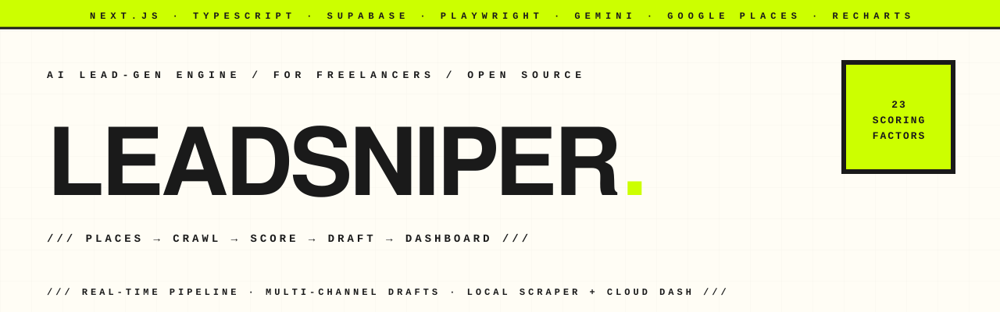

<p align="center">
  <picture>
    <source media="(prefers-color-scheme: dark)" srcset="assets-readme/hero-banner-dark.svg" />
    
  </picture>
</p>

<p align="center">
  <a href="https://github.com/hatimhtm/LeadSniper/actions/workflows/ci.yml"></a>
  
  
  
  
  <a href="LICENSE"></a>
</p>

<p align="center">
  <em><strong>An AI lead-generation engine for freelancers.</strong> Hand it a niche + a city; it queries Google Places, crawls each lead's website with Playwright, scores them across 23 factors, drafts personalised outreach with Gemini, and streams everything into a Next.js dashboard backed by Supabase real-time. ~7k LOC across a CLI scraper + dashboard. Built for the freelance prospecting workflow I wished existed.</em>
</p>

---

### `/// THE LOOP`

```
            niche + city
                 │
                 ▼
   ┌─────────────────────────────┐
   │ Google Places (new API)     │  ──┐
   │ → 60 raw candidates         │    │ failover between
   └──────────────┬──────────────┘    │ 2 API keys
                  │                   │
                  ▼                   │
   ┌─────────────────────────────┐    │
   │ Playwright crawler          │    │
   │ → homepage + about + contact│    │
   │ resource-blocked, 2× retry  │    │
   └──────────────┬──────────────┘    │
                  │                   │
                  ▼                   │
   ┌─────────────────────────────┐    │
   │ PageSpeed Insights API      │ ◀──┘
   │ → perf · a11y · SEO · BP    │
   └──────────────┬──────────────┘
                  │
                  ▼
   ┌─────────────────────────────┐
   │ 23-factor opportunity score │   no-website leads get
   │ (web · seo · social · cwv)  │   max points on web factors
   └──────────────┬──────────────┘   (they need the most help)
                  │
                  ▼
   ┌─────────────────────────────┐
   │ Gemini 2.5 Flash — drafts   │
   │ per-channel (email · WA ·   │
   │ DM) personalised outreach   │
   └──────────────┬──────────────┘
                  │ supabase realtime
                  ▼
   ┌─────────────────────────────┐
   │ Next.js dashboard           │
   │ Kanban · KPIs · Analytics · │
   │ Insights · Lead Detail      │
   └─────────────────────────────┘
```

---

### `/// WHY IT EXISTS`

Cold outreach for freelance work usually breaks down at the same two places: **finding the right businesses** (the ones who actually need what you sell, not random names from a directory) and **writing the message** (anything generic gets ignored). LeadSniper attacks both. The 23-factor scoring surfaces leads where the gap is visible — slow site, no SSL, missing meta, no social, dated stack — and the AI drafter consumes that same signal so the message you send actually references what's wrong instead of saying "I'd love to chat."

The scraper runs locally (Playwright + browser, your IP, your API keys). The dashboard runs anywhere (Vercel free tier). Supabase wires them together with real-time so you watch leads scoring live as the scraper crunches.

---

### `/// HIGHLIGHTS`

| | |
|---|---|
| **23-factor scoring** | Web presence (has site, HTTPS, mobile-responsive), SEO (title, description, schema, sitemap), social (FB/IG/LinkedIn/X presence), Core Web Vitals (LCP, FID, CLS), credibility (Google rating, review count), engagement (last update, contact methods). Each factor is a 0–10 sub-score; weighted into a 0–100 opportunity score. |
| **No-website logic** | A lead with no website gets the *maximum* score on every web factor — they're the customer who needs you most. Counter-intuitive but correct: a perfect 100/100 site doesn't need a developer. |
| **Real-time pipeline** | The scraper writes to Supabase as each lead is processed; the dashboard subscribes via `postgres_changes` and streams rows in. No polling, no refresh button. |
| **Multi-channel drafts** | Gemini drafts a `cold_email`, a `whatsapp_dm`, and a `linkedin_dm` per lead. Tone + service-type modifiers (gentle / direct / playful · website-build / SEO / ads). Regenerate any channel with custom prompt overrides. |
| **Failover Google Places keys** | Supply two `GOOGLE_PLACES_API_KEY_1/2`; the scraper rotates on 429 / quota errors and logs failed runs back to Supabase so the dashboard shows the actual failure mode. |
| **PageSpeed status-checked** | Calls `pagespeedonline/v5/runPagespeed` per lead with a 45s timeout. HTTP status is checked before JSON parse (avoids the silent crash on 4xx/5xx). |
| **Watch mode** | `LeadSniper.command` (double-click) → scraper polls `ms_search_requests` every 30s. Click "New search" in the dashboard, it dispatches a request, your local machine processes it. The dashboard never needs to ship Playwright. |
| **Resilient watch-mode polling** | Transient network errors (`TypeError`, `AbortError`, `ECONNRESET`, `ETIMEDOUT`, `ENOTFOUND`) are silently retried; only real errors hit the log. |
| **Local-first + cloud-native** | Your IP, your keys, your data — Playwright runs on your machine, never in a hosted browser farm. Supabase holds the persistent state. |

---

### `/// 23-FACTOR SCORE BREAKDOWN`

```
Web presence          ━━━━━━━━━━ 4 factors   (has site, HTTPS, mobile, modern stack)
SEO basics            ━━━━━━━━━━ 4 factors   (title, description, schema, sitemap)
Social proof          ━━━━━━━━━━ 4 factors   (Google rating, review count, response rate, recency)
Social media presence ━━━━━━━━━━ 4 factors   (FB, IG, LinkedIn, X)
Core Web Vitals       ━━━━━━━━━━ 3 factors   (LCP, FID, CLS)
Contact / engagement  ━━━━━━━━━━ 4 factors   (email exposed, phone, contact form, last update)
                                ───────────
                                  23 factors → 0–100 opportunity score
```

See `scraper/src/scorer.js` for the actual weighting.

---

### `/// QUICK START`

```bash
git clone https://github.com/hatimhtm/LeadSniper.git
cd LeadSniper

cp .env.example .env       # fill in Supabase URL + anon key (required)
                           # add Google Places + Gemini keys, OR set them
                           # later in the dashboard Settings page

# 1) Supabase schema
#    Open your Supabase project's SQL editor, paste supabase/schema.sql, run.

# 2) Dashboard
cd dashboard
npm install
npm run dev                # http://localhost:3000
cd ..

# 3) Scraper (separate terminal — keep it running)
cd scraper
npm install
npx playwright install chromium
node src/index.js watch    # idles until you trigger a search from the dashboard
```

Or double-click `LeadSniper.command` (macOS) to launch the scraper in watch mode.

---

### `/// PROJECT STRUCTURE`

```
LeadSniper/
├── dashboard/                   Next.js 14 app
│   ├── src/
│   │   ├── app/dashboard/       overview · search · snipe · leads · pipeline ·
│   │   │                         analytics · insights · settings · lead/[id]
│   │   ├── components/
│   │   │   ├── dashboard/       KPICard · LeadCard · LeadDetail
│   │   │   ├── ui/              ScoreGauge · SlideDrawer · LeadHoverCard · …
│   │   │   └── layout/          Sidebar · Navbar
│   │   ├── lib/                 supabase client · hooks · themes · utils · settings
│   │   ├── types/               Lead · Search · LeadStatus · SearchPreset · …
│   │   └── app/api/regenerate/  Gemini regenerate endpoint
│   └── package.json
├── scraper/
│   ├── src/
│   │   ├── index.js             commander CLI · 'snipe' + 'watch' + 'rescore' commands
│   │   ├── places.js            Google Places API + failover key rotation
│   │   ├── crawler.js           Playwright homepage + about + contact crawl
│   │   ├── analyzer.js          PageSpeed Insights + tech-stack detection
│   │   ├── scorer.js            23-factor scoring
│   │   ├── ai-drafter.js        Gemini per-channel message drafting
│   │   └── config.js            ENV_MAP — .env first, then ms_settings fallback
│   └── package.json
├── supabase/
│   └── schema.sql               ms_leads · ms_searches · ms_search_requests ·
│                                ms_settings · ms_contact_logs (+ RLS, indexes)
├── LeadSniper.command           macOS double-click launcher (watch mode)
├── .env.example                 every required var, with comments
└── .github/workflows/ci.yml     builds dashboard + lints scraper
```

---

### `/// SECURITY & PRIVACY`

- **No secrets committed.** `.env` is gitignored; the public `.env.example` is the only env file in version control.
- **API keys never leave your machine.** Google Places and Gemini are called from the local scraper, not from the dashboard. The dashboard only reads/writes Supabase.
- **Anon key only.** Supabase URL + anon key are in the dashboard env; service-role key isn't used anywhere. RLS policies in `schema.sql` keep the data scoped to the authenticated user.
- **Polite scraping.** Configurable `SCRAPER_DELAY_MIN`/`MAX` between Google Places calls, Playwright resource-blocking (no images/fonts), 2-retry with backoff, 30s page timeout.

---

### `/// USAGE EXAMPLES`

```bash
# One-shot scrape
node scraper/src/index.js "dental clinic" "Casablanca" --max 30

# Skip the expensive parts for a fast price-discovery pass
node scraper/src/index.js "real estate" "Paris" --skip-crawl --skip-ai

# Re-score existing leads in DB (after tweaking scorer.js)
node scraper/src/index.js rescore

# Watch mode — runs forever, polls the dashboard for queued searches
node scraper/src/index.js watch --interval 30
```

---

### `/// 2.0 — POLISH PASS`

- `.env.example` now lists every required var (Google Places × 2, Gemini, USER profile, scraper tuning) — was Supabase-only before.
- `scraper/src/config.js`: extracted `ENV_MAP` constant (was duplicated between `getConfig` + `getAllConfig`).
- `scraper/src/analyzer.js`: PageSpeed response now status-checked before `response.json()` (was a silent SyntaxError on 4xx/5xx).
- `scraper/src/index.js` watch loop: transient network errors broadened beyond the brittle `'fetch'` substring check.
- `dashboard/src/lib/hooks.ts`: silent error catches now log via `console.error` so they're at least debuggable.
- `dashboard/src/components/dashboard/LeadDetail.tsx`: regenerate failures surface as inline rose-tinted error messages with auto-clear (was silent `catch {}`).
- `dashboard/src/components/dashboard/LeadCard.tsx`: `hover:scale-110` (imperceptible on 14px icons) → `hover:opacity-70` (consistent muted-feedback pattern).
- New brutalist hero banner SVGs + README + CI workflow.

---

### `/// LICENSE`

[All Rights Reserved — Source-Visible](LICENSE).

This is **not** an open-source repository. The code is on GitHub for the
limited purpose of letting you **read it** — evaluate the engineering,
study the 23-factor scoring, see how Playwright + Gemini + Supabase
real-time fit together. That's it.

**Not allowed:** running it, deploying it, copying it into another project,
redistributing it, modifying it, sublicensing it, or commercially
exploiting it — even for free. "Free" doesn't equal "permitted."

If you want a commercial licence or a custom LeadSniper-style build for
your agency, [get in touch](mailto:hatimelhassak.official@gmail.com).

---

<p align="center">
  <a href="https://hatimelhassak.is-a.dev"></a>
  <a href="https://cal.com/hatimelhassak/engineering-discovery"></a>
  <a href="https://www.linkedin.com/in/hatim-elhassak/"></a>
  <a href="mailto:hatimelhassak.official@gmail.com"></a>
</p>

<p align="center">
  <code>///&nbsp;&nbsp;OPEN FOR NEW WORK&nbsp;&nbsp;///&nbsp;&nbsp;CONTRACT &amp; FREELANCE&nbsp;&nbsp;///&nbsp;&nbsp;REMOTE WORLDWIDE&nbsp;&nbsp;///</code>
</p>
